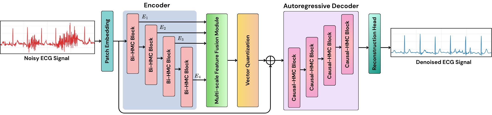
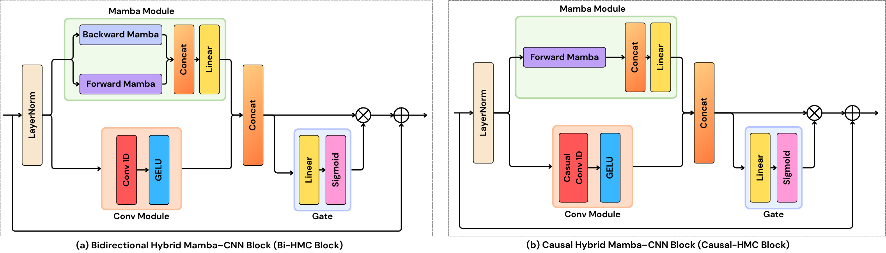
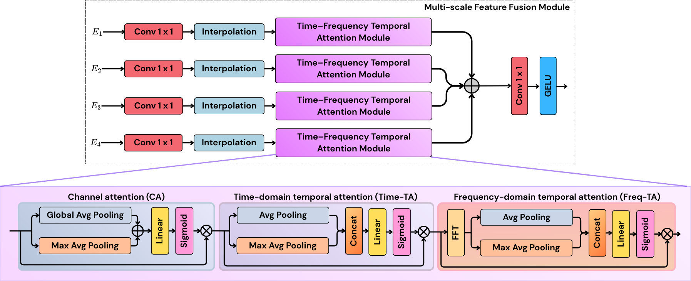

# ECG-ARD: Autoregressive ECG Denoising with Dual-Domain Fusion and a Vector-Quantized Bottleneck

This is the official PyTorch implementation repository of the ECG-ARD: Autoregressive ECG Denoising with Dual-Domain Fusion and a Vector-Quantized Bottleneck.

## ECG-ARD Architecture

  

  

  

## Prerequesites
- python 3.10
- pytorch 2.9.0
- mamba-ssm 2.2.6

## Results

  

  

